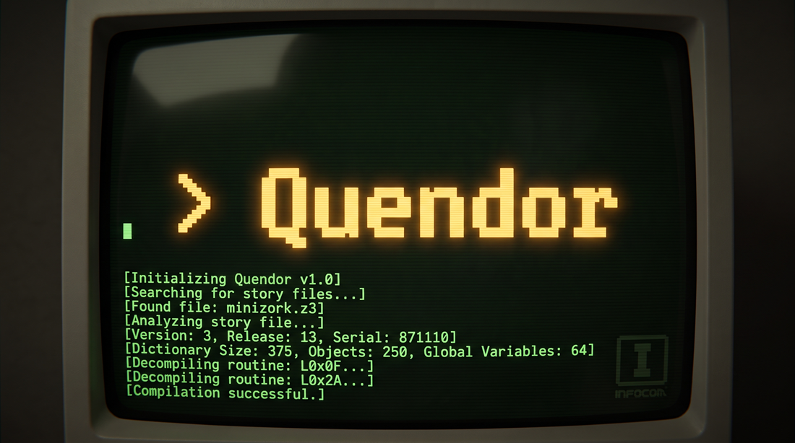

<h1 align="center">
  
</h1>

<p align="center">
  <em>A Specification-Accurate Z-Machine Implementation</em><br />
  <em>Early and Late Infocom + Modern Inform</em>
</p>

<p align="center">
   
  <a href="https://github.com/jeffnyman/quendor/blob/main/LICENSE"></a>
</p>

<p align="center">
  <a href="https://github.com/jeffnyman/quendor/actions/workflows/ci.yml"></a>
  <a href="https://renovatebot.com"></a>
  <a href="https://conventionalcommits.org"></a>
</p>

<p align="center">
  <a href="https://viteplus.dev"></a>
  <a href="https://oxc.rs"></a>
  <a href="https://nodejs.org"></a>
</p>

<div align="center"></div>

---

## Development

- Check everything is ready:

```bash
vp run ready
```

- Run the codebase intelligence:

```bash
vp exec fallow
```

- Run the tests:

```bash
vp run -r test
```

- Build the monorepo:

```bash
vp run -r build
```

- Run the development server:

```bash
vp run dev
```

- Add a shared dependency:

```bash
vp add <dependency> --save-catalog --filter <workspace-package>
```

## Contributing

Thanks for considering a contribution to Quendor! A few things to know before you dive in.

### Getting Started

```bash
git clone https://github.com/jeffnyman/quendor.git
cd quendor
vp install
```

See [Development](#development) above for the day-to-day commands.

### Workflow

`main` is protected; all changes go through a pull request, not a direct push:

```bash
git switch -c your-branch-name
# make your changes
git push -u origin your-branch-name
```

Then open a PR. It needs to pass CI (formatting, linting, type checks, tests, and a build) and be up to date with `main` before it can be merged.

### Commit Messages

Commits follow [Conventional Commits](https://www.conventionalcommits.org) (`type(scope): subject`), enforced by a commit-msg hook.

### Dependencies

This project uses pnpm catalogs to pin shared dependency versions in one place. See the "Dependency Management" section in [AGENTS.md](AGENTS.md) for how to add or update a dependency correctly.

### AI Coding Assistants

If you use one, [AGENTS.md](AGENTS.md) is the source of truth for project conventions: `CLAUDE.md` and the other tool-specific instruction files are synced copies of it, not independently maintained.

## Crafted by Humans, Optimized for Everyone

This codebase was created and is maintained 100% without AI assistance. I believe in the value of human-written code for this project. To be clear: this isn't an anti-AI stance. I fully support developers using whatever tools help them build best. I simply wanted to see if, as a personal goal, I could tackle this project entirely on my own.

That said, I want to make contributing as seamless as possible for everyone. I have included AI instruction files (such as `CLAUDE.md`) in the repository. If you use AI coding assistants, these files will guide your tools to respect the project architecture, testing paradigms, and style constraints. This keeps your local workflow fast and any incoming pull requests clean. The goal here isn't to restrict how you write code, but to ensure that whether a feature is drafted by a human or an assistant, it ultimately respects the foundational engineering decisions of this repository.

## 👨‍💻 Author

<p align="center">
  Made with 🤍 by <a href="https://github.com/jeffnyman">Jeff Nyman</a>
</p>

<p align="center">
  
</p>

<p align="center">
  Written in TypeScript ✨ Compiles to JavaScript for distribution.
</p>

<p align="center">
  <a href="https://testerstories.com" target="_blank" >
    
  </a>
</p>
<p align="center">
  <a href="https://www.linkedin.com/in/jeffnyman/" target="_blank" >
    
  </a>
</p>

## ☦️ Doxazein (δοξάζειν)

<p align="center">
  חֶסֶד וֶאֱמֶת אַל־יַעַזְבֻךָ קָשְׁרֵם עַל־גַּרְגְּרֹתֶיךָ כָּתְבֵם עַל־לוּחַ לִבֶּךָ
</p>

<p align="center">
"Let not mercy and truth forsake thee:<br>
bind them about thy neck;<br>
write them upon the table of thine heart."<br>
<em>Proverbs 3:3</em>
</p>

## 🕹️ Acknowledgements

This project stands on the shoulders of the team at Infocom, the MIT-born company that invented the Z-Machine to let _Zork_, and everything that followed, run unmodified across nearly every computer of its era. Particular thanks go to Marc Blank and Joel Berez, who designed the Z-Machine's virtual architecture, and to Tim Anderson, Bruce Daniels, and Dave Lebling, whose work on _Zork_ at MIT gave the format a reason to exist. Thanks also to Graham Nelson, whose Inform language and Z-Machine Standards Document kept the format alive and well-documented long after Infocom itself was gone, making implementations like this one possible.

## ⚖️ License

The code used in this project is licensed under the [MIT license](https://github.com/jeffnyman/quendor/blob/main/LICENSE).

**Note:** This license applies _only_ to the code in this repository. The original Z-Machine concept, design, and any original assets belong to their respective copyright holders.

✨ Long live the classics.
