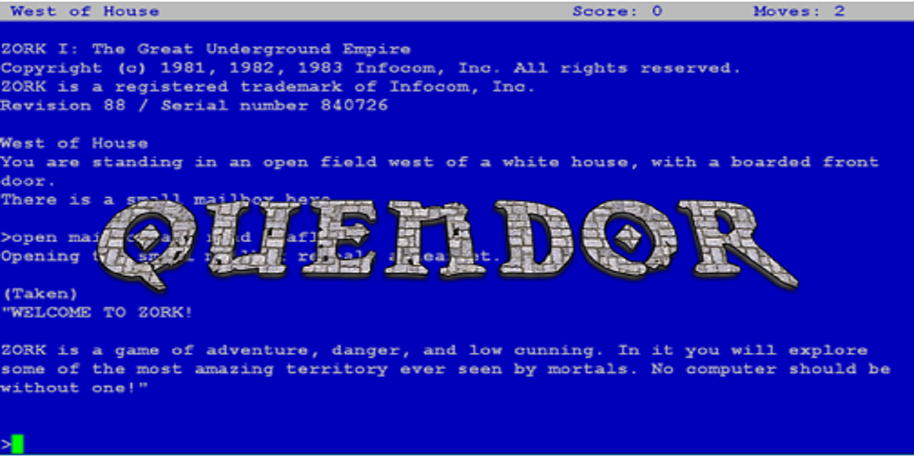
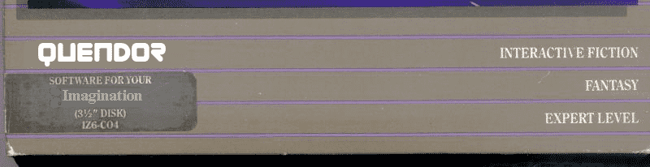

<h1 align="center">


</h1>

<div align="center">
<p><strong>A Specification-Accurate Z-Machine Implementation</strong></p>
<p><em>Aiming for Early and Late Infocom + Modern Inform</em></p>

[](https://www.npmjs.com/package/quendor)
[](https://github.com/jeffnyman/quendor/blob/main/LICENSE)
[](https://nodejs.org)

</div>

---

<blockquote>
<em>You are standing in a repository. There is a README here.</em>
<br><br>
&gt; <strong>read the README</strong>
</blockquote><br>

And thus begins my foray into learning how to emulate the Z-Machine. What does that mean, you ask? Well, let's head down a maze of twisty little passages.

---

<blockquote>
<em>You are standing in an open field west of a white house, with a boarded front door. You could circle the house to the north or south. There is a small mailbox here.</em>
<br><br>
&gt; <strong>open the mailbox</strong>
<br><br>
<em>Opening the small mailbox reveals a leaflet.</em>
<br><br>
&gt; <strong>read the leaflet</strong>
<br><br>
<em>"WELCOME TO ZORK, a game of adventure, danger, and low cunning. No computer should be without one!"</em>
</blockquote><br>

And thus begins [_Zork_](https://en.wikipedia.org/wiki/Zork), a text adventure game from the 1980s by a company called [Infocom](https://en.wikipedia.org/wiki/Infocom). It's really what started off the whole Z-Machine business and thus, indirectly, started off my interest in creating an emulator for it.

---

The goal of the Quendor project is to provide a working emulator of the [Z-Machine](https://en.wikipedia.org/wiki/Z-machine) and an interpreter for [z-code](http://fileformats.archiveteam.org/wiki/Z-code) programs that will run on that machine.

<p align="center">

</p>

As part of this project page, I state that Quendor will strive to be specification _accurate_, which is different than saying specification _complete_. A reference implementation needs to be specification complete. That's _why_ it's a reference implementation in the first place. Quendor's aims are a bit more modest in that this project is _entirely_ pedagogical in nature, essentially being created in order to understand how to write the emulator and interpreter and to better understand the Z-Machine itself.

---

The Z-Machine is the virtual machine Infocom designed in 1979 to run its text adventures, and that Inform still targets today. **Quendor** — named for the ancient kingdom that became the Great Underground Empire — is a faithful reimplementation of that machine: give it a story file and it plays.

⚠️ **Pre-1.0, and honest about it.** Quendor currently plays **Z-code versions 1–3**. That's enough to run _Zork I_ from start to finish, and enough to pass the [czech](#conformance) v3 conformance suite (349/349). Versions 4–8, save/restore, and the full screen model are in progress. See [Version support](#version-support).

## Install

```bash
npm install -g quendor
```

This puts two commands on your path — `quendor` and its short alias `qdor` — which are the same terminal player.

## Play

```bash
quendor path/to/zork1.z3
```

### Options

| Flag           | Description                                                                         |
| -------------- | ----------------------------------------------------------------------------------- |
| `--seed N`     | Fix the RNG seed for reproducible playthroughs (handy for testing and bug reports). |
| `-h`, `--help` | Print usage and exit.                                                               |

## Use as a library

Quendor ships as an engine, not just a player. The main entry is **pure**: no DOM, no `node:` built-ins. So, it runs unchanged in the browser or in Node. The Node-only story loader lives behind a separate `quendor/node` entry, so importing the engine never pulls in `node:fs`.

```ts
import { Machine, RunState } from "quendor";
import { loadStoryFromFile } from "quendor/node";

const story = await loadStoryFromFile("zork1.z3");
const machine = new Machine(story, { randomSeed: 1 });

machine.onOutput = (text) => process.stdout.write(text);

// Drive the fetch–decode–execute loop, feeding input when the game asks.
while (machine.run() === RunState.WaitingForInput) {
  machine.provideInput(await readCommandFromSomewhere());
}
```

In a browser you would load the story bytes yourself (`fetch` → `Uint8Array` → `new Story(bytes)`) and skip the `quendor/node` import entirely.

The package is fully typed; `Machine`, `Story`, the instruction decoder, the Z-text codec, and the object/property tables are all exported from the main entry.

## Version support

| Z-code version | Status                                                         |
| -------------- | -------------------------------------------------------------- |
| v1 – v3        | **Playable.** _Zork I_ completes; passes czech v3 conformance. |
| v4 – v5        | In progress.                                                   |
| v6             | Not yet (graphical, needs the full screen model).              |
| v7 – v8        | Not yet.                                                       |

Save/restore (Quetzal) and the complete windowed screen model are planned.

## Conformance

Correctness is checked against **czech** (Comprehensive Z-machine Emulation CHecker), a test program that self-verifies a large fraction of the opcode set and prints a pass/fail report. Quendor passes it clean for v3:

```
Passed: 349, Failed: 0, Print tests: 19
```

That suite runs as part of the automated test suite on every CI build, so opcode regressions surface immediately.

## Development

```bash
vp install   # install dependencies
vp test      # run the unit + conformance tests
vp pack      # build the library
```

Quendor is part of a larger project — a Z-Machine engine plus a companion debugger — developed in the open as a study in specification-accurate implementation. See the [project repository](https://github.com/jeffnyman/quendor) for the full story, architecture notes, and the reference material behind it.

## License

[MIT](https://github.com/jeffnyman/quendor/blob/main/LICENSE) © Jeff Nyman

<h1 align="center">



</h1>
